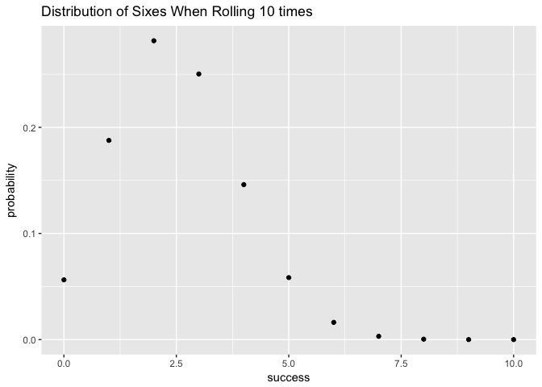
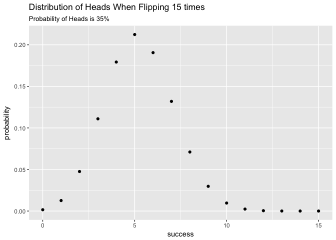

Hw 03
================
Phoebe Abramowitz
3/14/2018

``` r
library(ggplot2)
```

Question 2
==========

``` bash
cut -d "," -f 2 nba2017-roster.csv > team-names.txt
sort -u team-names.txt > team-names.txt
head -n 5 team-names.txt
```

``` bash
cut -d "," -f 3 nba2017-roster.csv > position-names.txt
sort -u position-names.txt > position-names.txt
head -n 5 position-names.txt
```

``` bash

cut -d "," -f 7 nba2017-roster.csv | tail +2 | sort -n | uniq -c | sort -r  >experience-counts.txt
head -n 5 experience-counts.txt
```

    ##   80 0
    ##   52 1
    ##   46 2
    ##   36 3
    ##   35 4

``` bash
grep "LAC\|team" nba2017-roster.csv > LAC.csv
cat LAC.csv
```

    ## "player","team","position","height","weight","age","experience","salary"
    ## "Alan Anderson","LAC","SF",78,220,34,7,1315448
    ## "Austin Rivers","LAC","SG",76,200,24,4,1.1e+07
    ## "Blake Griffin","LAC","PF",82,251,27,6,20140838
    ## "Brandon Bass","LAC","PF",80,250,31,11,1551659
    ## "Brice Johnson","LAC","PF",82,230,22,0,1273920
    ## "Chris Paul","LAC","PG",72,175,31,11,22868828
    ## "DeAndre Jordan","LAC","C",83,265,28,8,21165675
    ## "Diamond Stone","LAC","C",83,255,19,0,543471
    ## "J.J. Redick","LAC","SG",76,190,32,10,7377500
    ## "Jamal Crawford","LAC","SG",77,200,36,16,13253012
    ## "Luc Mbah a Moute","LAC","SF",80,230,30,8,2203000
    ## "Marreese Speights","LAC","C",82,255,29,8,1403611
    ## "Paul Pierce","LAC","SF",79,235,39,18,3500000
    ## "Raymond Felton","LAC","PG",73,205,32,11,1551659
    ## "Wesley Johnson","LAC","SF",79,215,29,6,5628000

``` bash
grep "LAL" nba2017-roster.csv | cut -d "," -f 6 | sort -n | uniq -c | cat
```

    ##    2 19
    ##    1 20
    ##    2 22
    ##    3 24
    ##    2 25
    ##    2 30
    ##    2 31
    ##    1 37

``` bash
grep "CLE" nba2017-roster.csv | wc -l
```

    ##       15

``` bash
grep "GSW\|team" nba2017-roster.csv | cut -d "," -f 1,4-4,5-5 >gsw-height-weight.csv
cat gsw-height-weight.csv
```

    ## "player","height","weight"
    ## "Andre Iguodala",78,215
    ## "Damian Jones",84,245
    ## "David West",81,250
    ## "Draymond Green",79,230
    ## "Ian Clark",75,175
    ## "James Michael McAdoo",81,230
    ## "JaVale McGee",84,270
    ## "Kevin Durant",81,240
    ## "Kevon Looney",81,220
    ## "Klay Thompson",79,215
    ## "Matt Barnes",79,226
    ## "Patrick McCaw",79,185
    ## "Shaun Livingston",79,192
    ## "Stephen Curry",75,190
    ## "Zaza Pachulia",83,270

``` bash

cut -d "," -f 1,8 nba2017-roster.csv| head -n 1 >top10-salaries.csv
cut -d "," -f 1,8 nba2017-roster.csv | sort -n -r -t "," -k2 | head -n 10 >> top10-salaries.csv
```

Question 3
==========

``` r
#source binomial-functions R script
source('code/binomial-functions.R')
bin_probability(10,3,1/6)
```

    ## [1] 0.1550454

``` r
sixes <- bin_distribution(10,0.25)
ggplot(data=sixes)+
  geom_point(aes(x=success,y=probability))+
  ggtitle("Distribution of Sixes When Rolling 10 times")
```



``` r
cum <- rep(0,3)
for (i in 3:5){
  if (i==3){
  cum <- bin_probability(5,i,0.35)
  }
  else{
    cum <- cum+ bin_probability(5,i,0.35)
  }
}
cum
```

    ## [1] 0.2351694

``` r
loaded_heads <- bin_distribution(15,0.35)
ggplot(data=loaded_heads)+
  geom_point(aes(x=success,y=probability))+
  ggtitle("Distribution of Heads When Flipping 15 times",subtitle="Probability of Heads is 35%")
```


